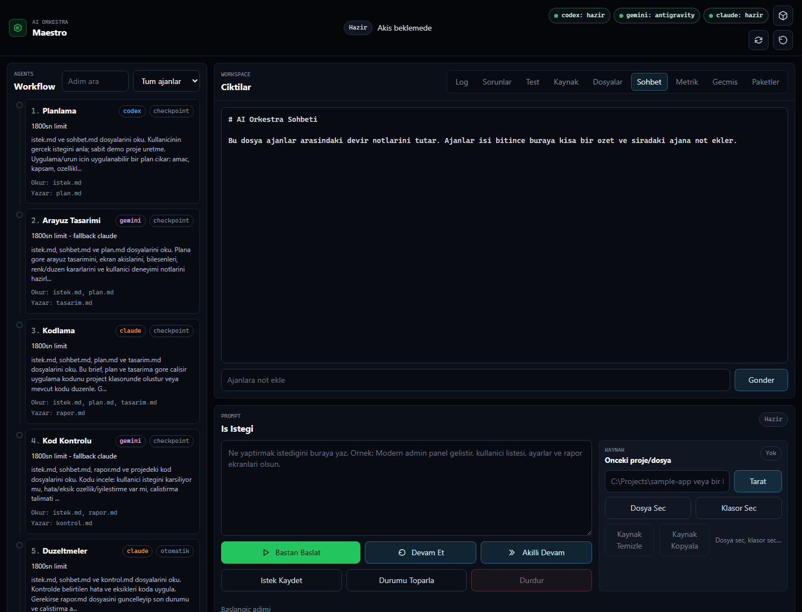
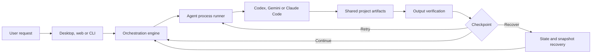

<p align="center">
  <strong>MAESTRO</strong><br />
  <sub>Local-first orchestration for Codex, Gemini and Claude Code</sub>
</p>

<p align="center">
  <a href="#quick-start">Quick start</a> ·
  <a href="#how-it-works">Architecture</a> ·
  <a href="#safety-and-recovery">Safety</a> ·
  <a href="#türkçe-özet">Türkçe</a>
</p>

<p align="center">
  
  
  
</p>

Maestro coordinates multiple coding agents through explicit, file-based handoffs. Each stage reads the shared project state, produces named artifacts and passes control to the next agent. Checkpoints, snapshots, validation and recovery are built into the workflow instead of being left to prompt convention.

<p align="center">
  
</p>

## Why Maestro

| Capability | What it changes |
|---|---|
| File-based handoffs | Agents exchange durable artifacts such as `plan.md`, `tasarim.md` and `rapor.md` instead of relying on hidden chat context. |
| Human checkpoints | A workflow can pause after any stage for continue, retry or stop decisions. |
| Resume and recovery | Interrupted runs can continue from saved state or be repaired from existing outputs. |
| Verification gates | Expected files and syntax checks are validated before a stage is accepted. |
| Fallback routing | Limit, login, timeout and missing-tool failures are classified and can route to a configured fallback agent. |
| Local audit trail | Events, run summaries, workflow versions and snapshots stay inside the selected project directory. |

## How it works



The main surfaces share the same engine:

- `gui.py` — desktop application;
- `web_panel.py` — browser dashboard and local HTTP server;
- `menu.py` — terminal control surface;
- `orkestra.py` — workflow validation, state, snapshots, recovery and execution;
- `runner.py` — subprocess execution shared by desktop and web;
- `workflow.py` — editable stage definitions.

## Quick start

### 1. Install

Python 3.11 or newer is required. Install at least one supported agent CLI and sign in with its official login flow.

```bash
python -m venv .venv

# Windows
.venv\Scripts\activate

# macOS / Linux
source .venv/bin/activate

pip install -e .[dev]
```

### 2. Start a surface

```bash
# Browser dashboard — http://127.0.0.1:8765
python web_panel.py --open

# Desktop app
python gui.py

# Terminal menu
python menu.py
```

On Windows, `uygulama.bat` and `web_panel.bat` provide double-click launchers.

### 3. Customize the workflow

Edit `workflow.py` to choose stages, agents, inputs, outputs, time limits, checkpoints and fallback behavior. The default sequence follows a practical delivery loop:

```text
plan → design → implement → review → repair → deliver
```

## Supported agent backends

Maestro invokes installed command-line tools directly; it does not scrape or automate vendor web interfaces.

| Agent | Default command path |
|---|---|
| Codex | `codex exec` |
| Gemini | Antigravity CLI via `agy -p` |
| Claude Code | `claude -p` |

Availability, billing and usage limits remain governed by each provider account. Maestro does not bundle credentials or bypass provider controls.

## Safety and recovery

- Preflight checks verify tools, project access and workflow validity before execution.
- The web panel binds to `127.0.0.1` by default.
- A non-local bind requires an access token; one is generated if `--token` is omitted.
- Snapshots are taken before stages and can be inspected or restored.
- Child-process shutdown and stuck-stage handling are explicit recovery paths.
- Runtime logs, prompts, events and snapshots are excluded from the public repository by `.gitignore`.

Do not commit project runtime folders: prompts and generated artifacts may contain private source code or operational data. See [SECURITY.md](SECURITY.md) for vulnerability reporting.

## Verification

The public release was checked on Windows with Python 3.13:

```text
100 automated tests passed
python -m compileall completed successfully
known credential-prefix scan returned zero hits
```

These checks verify the local engine and test doubles. Real-agent execution still depends on locally installed CLIs, authenticated provider accounts and their current availability.

Run the same checks locally:

```bash
python -m pytest -q
python -m compileall -q .
```

## Repository map

```text
maestro/
├─ gui.py                 desktop interface
├─ web_panel.py           browser panel and local server
├─ orkestra.py            orchestration and recovery engine
├─ runner.py              shared agent process runner
├─ workflow.py            workflow definitions
├─ ui_tabs/               desktop tool panels
├─ web/static/            web interface assets
├─ tests/                 engine, runner, web and security tests
└─ tools/                 repository validation helpers
```

## Contributing

Focused bug reports and reproducible improvement proposals are welcome. Read [CONTRIBUTING.md](CONTRIBUTING.md) before opening a pull request. Security issues should be reported privately as described in [SECURITY.md](SECURITY.md).

## Türkçe özet

Maestro; Codex, Gemini ve Claude Code'u aynı proje klasöründe dosya tabanlı paslaşma ile sırayla çalıştıran yerel bir orkestrasyon aracıdır. Aşamalar arasında kontrol noktaları koyar, yarım kalan çalışmaları sürdürür, beklenen çıktıları doğrular ve hata durumunda toparlama seçenekleri sunar.

En hızlı başlangıç için `pip install -e .[dev]` komutundan sonra `python web_panel.py --open` çalıştırabilirsin.

---

<p align="center">
  Built by <a href="https://escompanystudio.com">ES Company Studio</a> in Türkiye.
</p>
